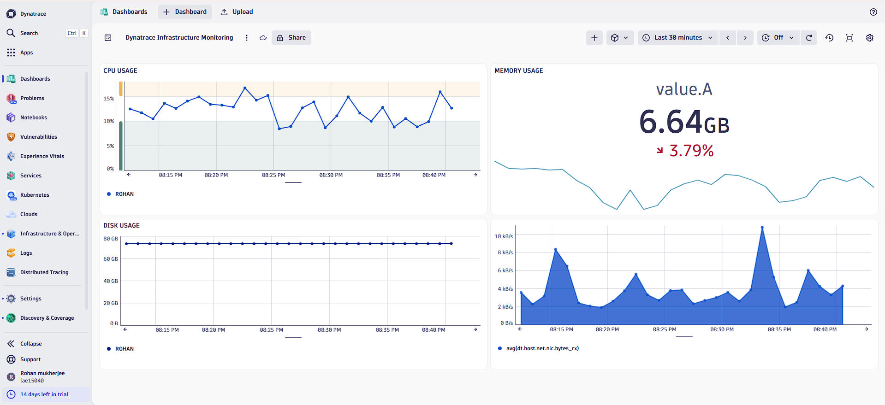
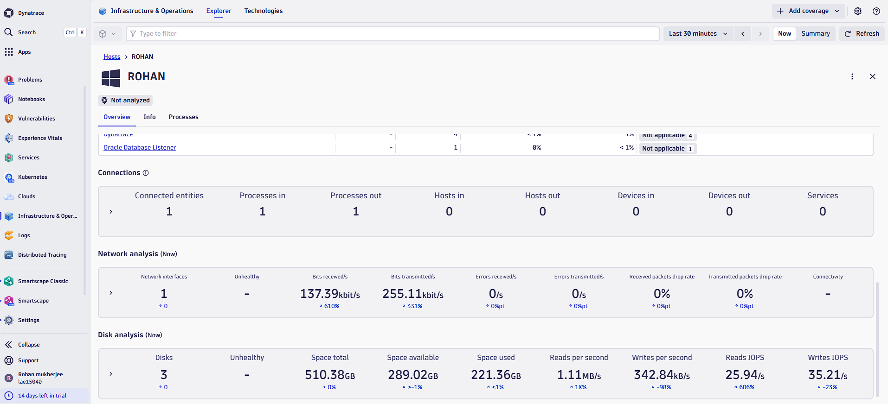
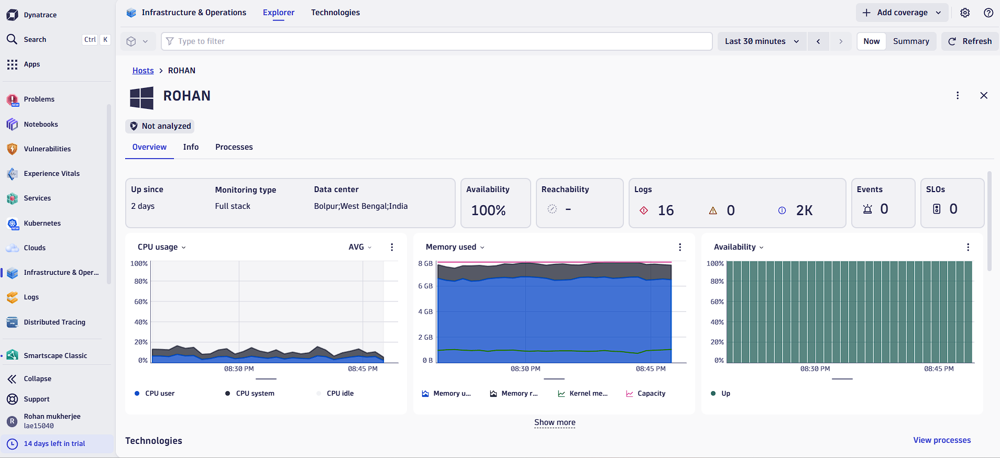
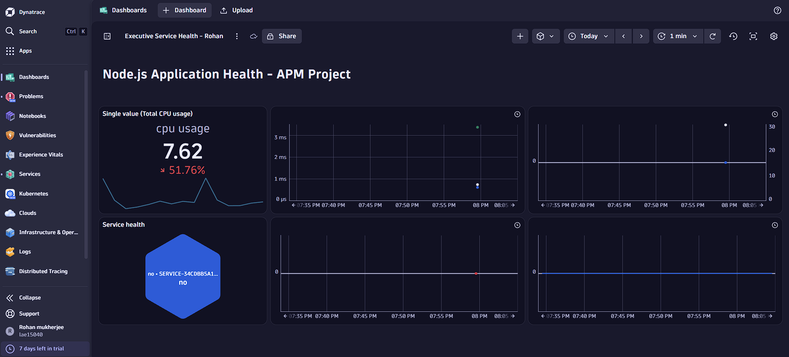
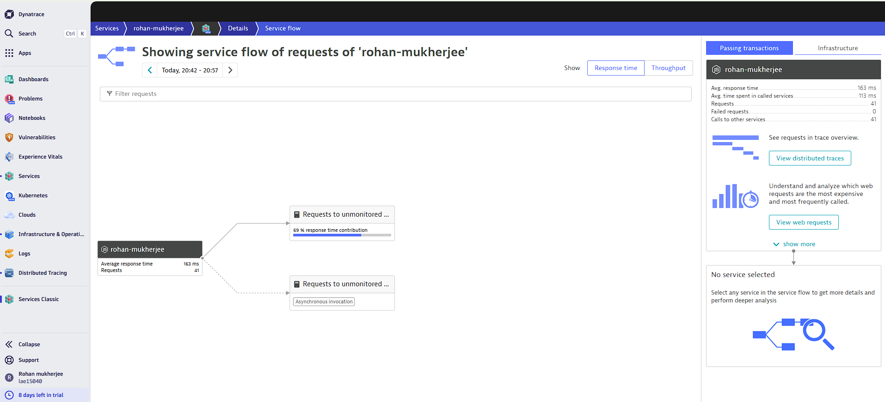
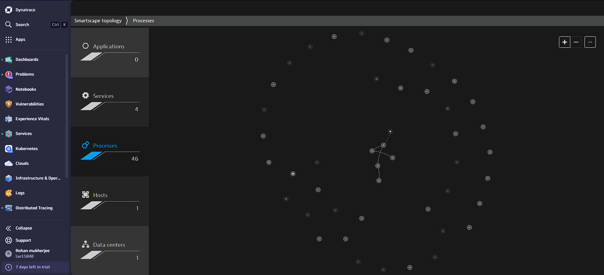
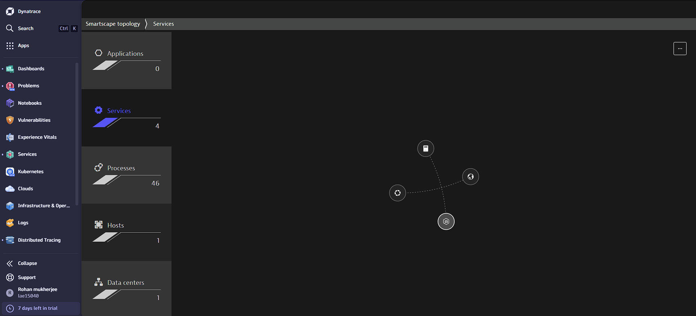

# Enterprise-Grade Full-Stack Observability Suite — Powered by Dynatrace

A comprehensive, production-ready Observability architecture designed to deliver end-to-end visibility across hybrid cloud infrastructure, application tiers, and network layers. This project leverages Dynatrace OneAgent and Davis AI to monitor node health, optimize application performance (APM), track distributed transactions, and reduce MTTR via automated root-cause detection.

---

## Architecture Modules & Key Implementations

### 1. Hybrid Infrastructure Monitoring (Core Layer)
* Deployed and automated Dynatrace OneAgent across Linux environments (ROHAN) for zero-configuration metric ingestion.
* Designed enterprise cockpits tracking continuous health indicators: CPU Load, Memory Profiling (6.64 GB state), Storage Volumes, and Network NIC throughput.

### 2. Application Performance Monitoring (APM Tier)
* Configured deep-tier APM for a production-grade Node.js Microservice (rohan-mukherjee).
* Built real-time charts capturing critical application metrics: Response Time (ms), Request Throughput, and Failure Rates (100% boundary monitoring).

### 3. Distributed Tracing & Chaos/Error Engineering
* Utilized Distributed Tracing (Spans & Histograms) to isolate end-to-end code execution paths and track synchronous/asynchronous invocations.
* Investigated runtime anomalies, specifically tracing HTTP 500 Server Errors and failed endpoint operations (/fail) down to the exact millisecond timestamps.
* Visualized request routing structures using automated Service Topology trees to track upstream/downstream payload distribution.

### 4. AI-Driven Incident Management & Autonomous Root-Cause
* Integrated Dynatrace’s proprietary Davis AI engine for intelligent, baseline-driven anomaly detection to prevent alert fatigue.
* Simulated infrastructure failures and audited active incident ticketings (e.g., Problem P-260312: Failure rate increase), tracking mean-time-to-resolution (MTTR) under real-world pressure constraints.

---

## Step-by-Step Technical Insights & Visual Proof of Work

### Module 1: Core Infrastructure Performance & Node Health

#### Host Telemetry Dashboard

Custom enterprise cockpit built to capture real-time host telemetry. It tracks memory consumption state (currently showing 6.64 GB utilization), overall CPU allocation curves, and active storage volume baselines.

#### Network and Core Analytics

Granular network I/O analysis mapping host data transfer rates. This panel audits network interfaces, tracking average bits received and transmitted (kilobits per second) alongside disk write/read IOPS profiling to eliminate hardware storage bottlenecks.

#### Host Infrastructure Overview

Deep-dive control room for the host machine named ROHAN. This section provides a 100% machine availability index, validating continuous uptime, background OS kernel processes, and core resource boundaries.

#### Smartscape Classic Infrastructure Layer

Live topological view of the infrastructure layer. It displays automated discovery of interconnected data centers, host clusters, and lower-level active system processes before application mapping.

---

### Module 2: Application Performance Monitoring (APM) & Service Health

#### Service Health Cockpit

High-level executive dashboard tracking the overall service health architecture. The panel flags critical application failure boundaries and sudden spikes in server workload behaviors.

#### Golden Signals Technical Dashboard

Dedicated APM dashboard for the instrumented Node.js application. It captures the four golden signals: response times, operational throughput, active HTTP error rates, and the 100% threshold boundary for failure spikes.

#### Post-Incident Application Baselining

Continuous performance monitor captured during runtime adjustments. It audits the normalization of memory workloads and stabilizing CPU trends after hot-fixing code degradation.

---

### Module 3: Distributed Tracing & Deep Error Diagnostics

#### Distributed Tracing Exploratory Interface

Granular exploratory view of distributed transactions. This interface maps microservices requests over a 30-minute interval, calculating individual transaction duration distribution histograms.

#### Granular Span Execution Logs

Deep dive into microservice execution tracks. It isolates end-to-end duration spans down to microsecond limits, verifying code-level bottlenecks across backend components.

#### Critical HTTP 500 Error Footprints

Granular error diagnostics dashboard capturing active runtime crashes. It documents failed transaction logs pinpointing continuous HTTP 500 Server Errors triggered on the specific /fail endpoint.

#### End-to-End Service Flow Tree

Automated service flow graph visualizing structural request paths. It tracks transaction propagation from user endpoints, detailing exactly how much request time contribution goes into unmonitored external calls versus core code execution.

#### Service Explorer Metrics

Comprehensive analytics hub for the service named rohan-mukherjee. It organizes key operational indicators including average response trends, database calls, and network dependencies inside a single diagnostic view.

---

### Module 4: Davis AI Autonomous Problem Resolution

#### Autonomous Root-Cause Analysis Panel

Live incident response system managed by the Davis AI engine. The panel captures a high-priority incident (Problem P-260312: Failure rate increase), executing a deterministic root-cause search across the topology to significantly lower MTTR.

---

## Details: Strategic Value & Operational Excellence
* **Proactive Security:** Maintained continuous compliance audits across host resources without exposing critical internal components.
* **Cost Governance:** Mapped memory behavior and network data payloads over time to facilitate intelligent compute rightsizing and save organizational cloud budgets.
* **Business Resiliency:** Accelerated debugging speeds from hours to seconds by transforming raw infrastructure logs into rich, actionable, and visual business intelligence graphs.
