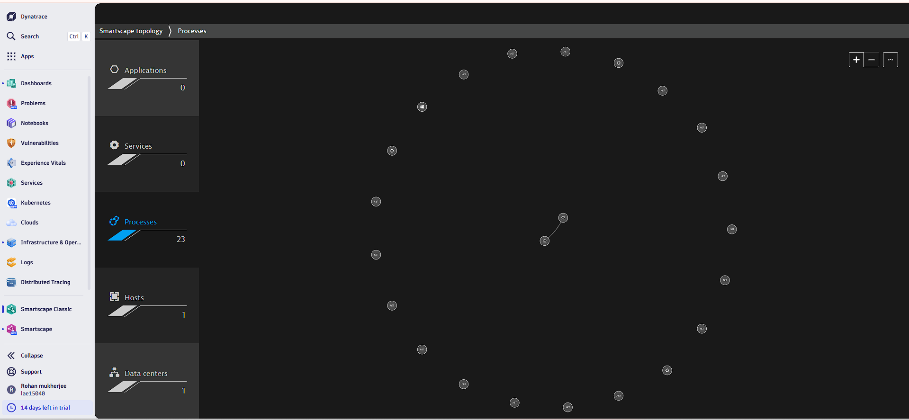
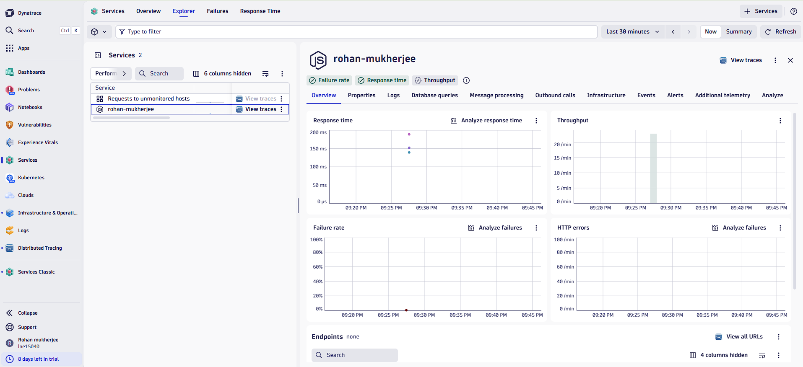

# Enterprise-Grade Full-Stack Observability Suite — Powered by Dynatrace

A comprehensive, production-ready Observability architecture designed to deliver end-to-end visibility across hybrid cloud infrastructure, application tiers, and network layers. This project leverages Dynatrace OneAgent and Davis AI to monitor node health, optimize application performance (APM), track distributed transactions, and reduce MTTR via automated root-cause detection.

---

## Architecture Modules & Key Implementations

### 1. Hybrid Infrastructure Monitoring (Core Layer)
* **Agent Automation:** Deployed and automated Dynatrace OneAgent across Linux environments (ROHAN) for zero-configuration metric ingestion.
* **Host Telemetry:** Designed enterprise cockpits tracking continuous health indicators: CPU Load, Memory Profiling (6.64 GB state), Storage Volumes, and Network NIC throughput.

### 2. Application Performance Monitoring (APM Tier)
* **Runtime Instrumentation:** Configured deep-tier APM for a production-grade Node.js Microservice (rohan-mukherjee).
* **Golden Signals Tracking:** Built real-time charts capturing critical application metrics: Response Time (ms), Request Throughput, and Failure Rates (100% boundary monitoring).

### 3. Distributed Tracing & Chaos/Error Engineering
* **Transaction Diagnostics:** Utilized Distributed Tracing (Spans & Histograms) to isolate end-to-end code execution paths and track synchronous/asynchronous invocations.
* **Failure Analysis:** Investigated runtime anomalies, specifically tracing HTTP 500 Server Errors and failed endpoint operations (/fail) down to the exact millisecond timestamps.
* **Service Flow Mapping:** Visualized request routing structures using automated Service Topology trees to track upstream/downstream payload distribution.

### 4. AI-Driven Incident Management & Autonomous Root-Cause
* **Davis AI Core:** Integrated Dynatrace’s proprietary Davis AI engine for intelligent, baseline-driven anomaly detection to prevent alert fatigue.
* **Problem Lifecycle Analysis:** Simulated infrastructure failures and audited active incident ticketings (e.g., Problem P-260312: Failure rate increase), tracking mean-time-to-resolution (MTTR) under real-world pressure constraints.

---

##  Enterprise Dashboard Insights & Proof of Work

### Module A: Full-Stack Infrastructure & Smartscape Topology

*Automated AI mapping visualizing deep structural correlations between data centers, hosts, and running network processes.*

### Module B: Application Performance (APM) & Golden Signals

*Real-time executive dashboard indicating a sudden spike in Application Failure Rates alongside corresponding HTTP Error counts.*

### Module C: Distributed Tracing & Error Investigation

*Granular tracing logs capturing HTTP 500 error footprints on specific endpoints (/fail) with absolute precision.*

### Module D: Davis AI Autonomous Problem Resolution

*Active Davis AI panel conducting deterministic root-cause analysis on an escalating service degradation ticket.*

---

## Details: Strategic Value & Operational Excellence
* **Proactive Security:** Maintained continuous compliance audits across host resources without exposing critical internal components.
* **Cost Governance:** Mapped memory behavior and network data payloads over time to facilitate intelligent compute rightsizing and save organizational cloud budgets.
* **Business Resiliency:** Accelerated debugging speeds from hours to seconds by transforming raw infrastructure logs into rich, actionable, and visual business intelligence graphs.
